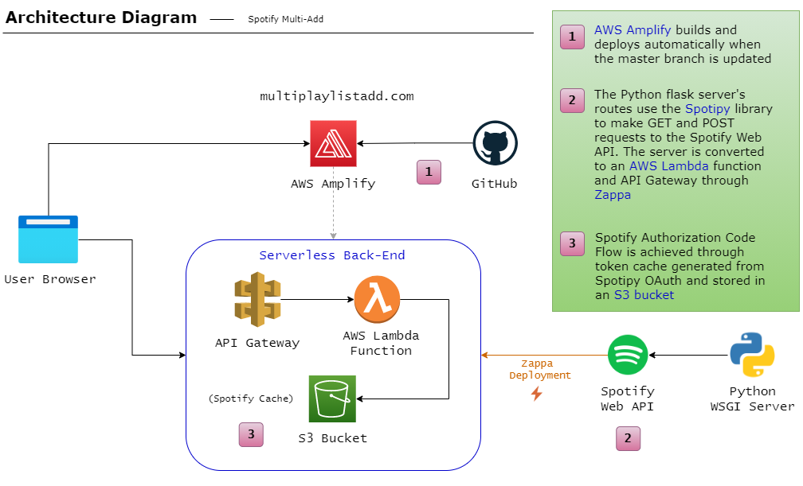
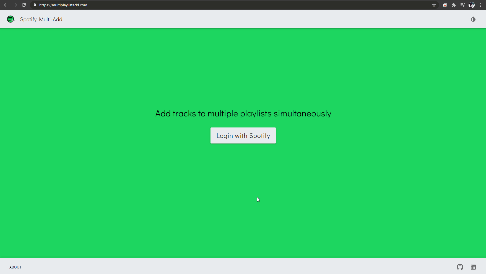
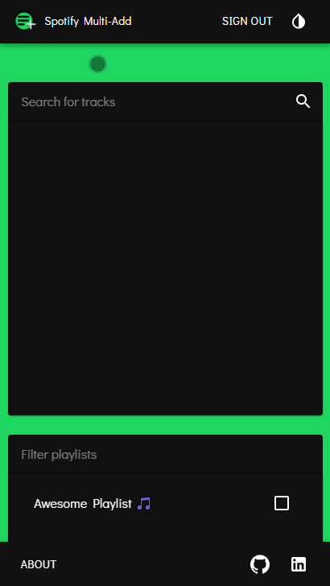

# Spotify Multi-Add &nbsp; 
> **Spotify Multi-Add** is a full stack application to search for tracks and add them to more than one of your playlists simultaneously.

If you have a [Spotify](https://www.spotify.com/) account, go to https://multiplaylistadd.com to access the app. 

In order to learn how to develop a full stack application and utilize technologies that are common in the field, something that I didn't learn in college, I built this website from the ground up to strengthen my skills and knowledge base in web development.

* [Usage](https://github.com/ntgarrett/Spotify_multi-add#select-a-track-and-add-it-to-more-than-one-playlist)
* [Front End](front_end/README.md) 
* [Back End](back_end/README.md)
* [Todo List](https://github.com/ntgarrett/Spotify_multi-add#todo-list)
* [Contact](https://github.com/ntgarrett/Spotify_multi-add#contact)

## Service Architecture

 

 
 

## Technologies 
&nbsp;&nbsp;&nbsp;&nbsp;&nbsp; 

Spotify Multi-Add uses the [Spotipy](https://spotipy.readthedocs.io/en/2.16.1/) library to implement [Spotify Authorization Code Flow](https://developer.spotify.com/documentation/general/guides/authorization-guide/#authorization-code-flow). The Flask server is converted into a Serverless AWS Lambda function and deployed via [Zappa](https://github.com/Miserlou/Zappa). The front end is hosted with AWS Amplify and changes pushed to the master branch are built and deployed automatically.
 
 

## Select a track and add it to more than one playlist

Adding a track to multiple playlists is made easy. Simply search for and select a track, then check the playlists you'd like to add it to. If you have a lot of playlists, use the filter to find specific ones. Press the play button on the track to open it in Spotify.

 

## Responsive styling

Mobile browsing is supported:

## Todo List

* Improve server error handling
* Implement analytics
* Add a "Create a playlist" feature
 
 

## Contact

&nbsp; 